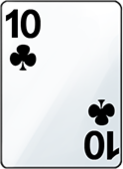
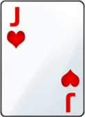
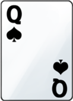
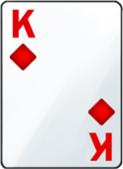
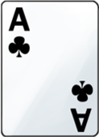
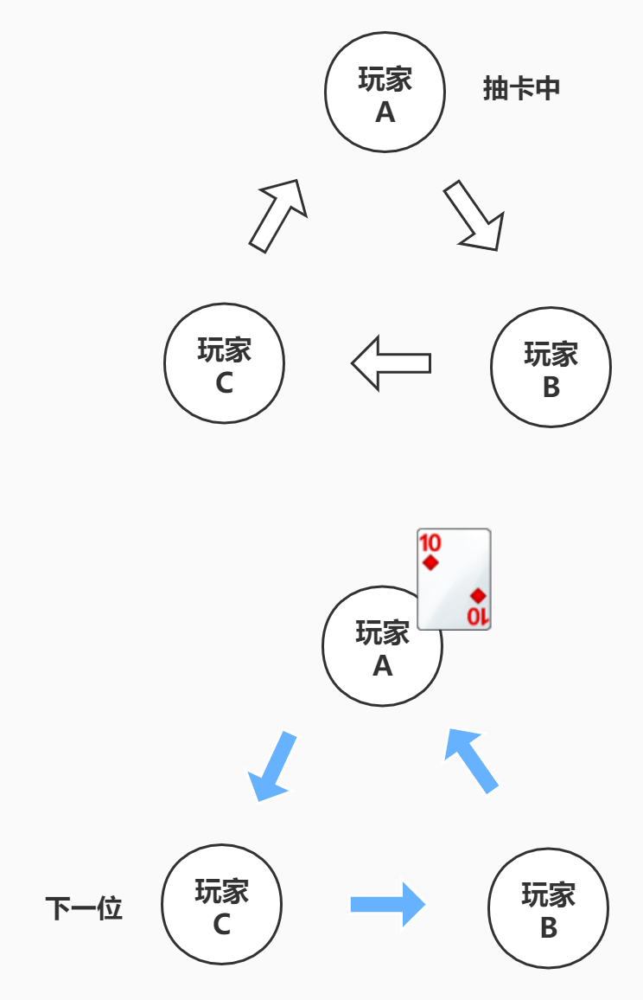
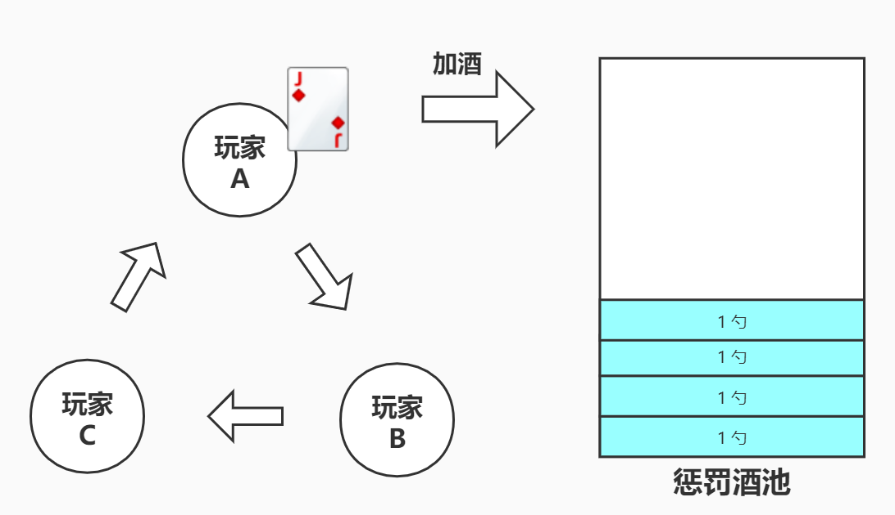
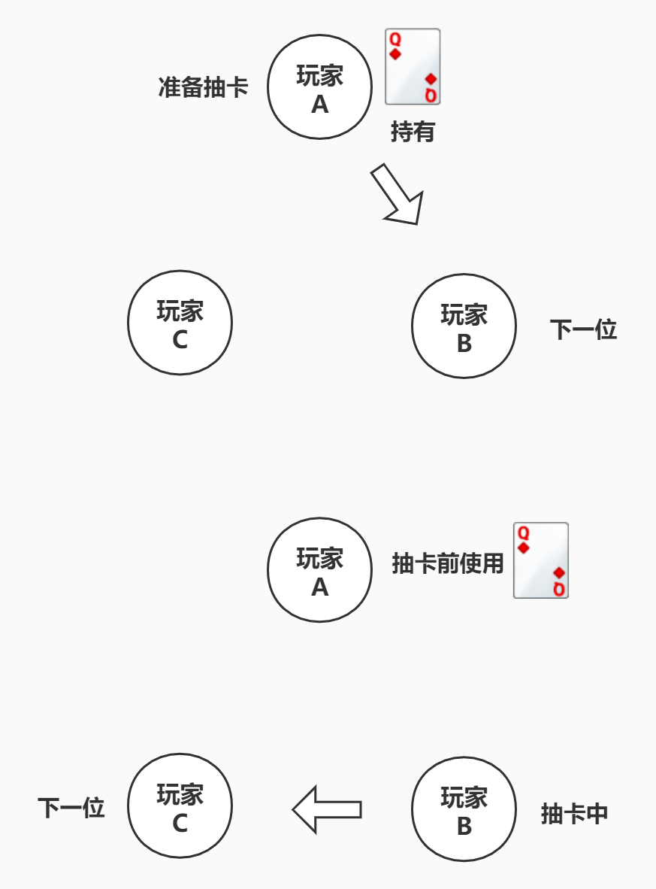
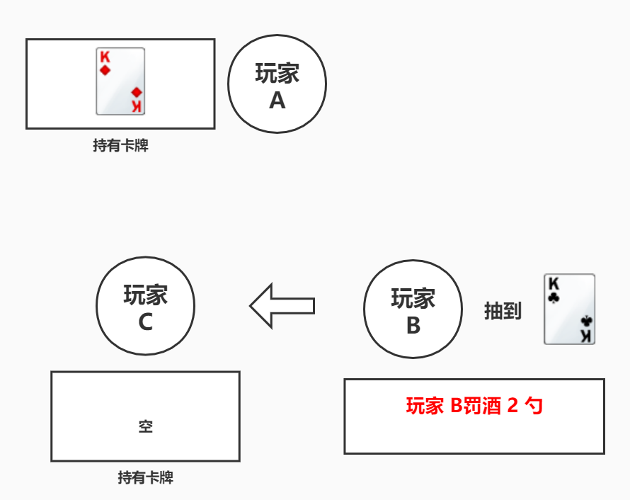
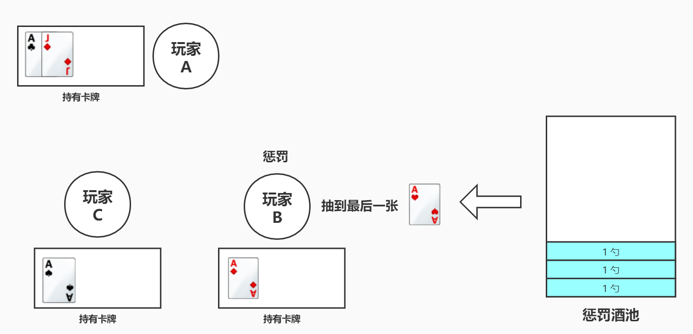

# 摸Ace

该游戏适合于多人，在酒桌上，罚酒的小游戏。

每场游戏至少2名玩家参与，玩家之间顺序从20张的卡组中随机的抽出一张卡牌，并且根据抽到卡片的效果决定游戏走向。

当4张A都被抽到时，游戏结束。

## 说明

游戏卡牌总计20张，分别是

每种花色各四张。

每种不同的卡片类型，具有不同的效果。

## 10 抽卡翻转

抽到10的玩家将会逆转抽卡的顺序，如下：

## J 加酒

抽到J的玩家有权利向，酒池中加入1-3勺数量的酒，酒池中的酒将会通过J卡片不断累积，
这些酒将会作为抽到最后一张A玩家的惩罚。

## Q 抽卡跳过

持久Q的玩家，可以在抽卡前使用该卡牌跳过本次抽卡机会，轮转到下一位玩家抽卡。每张Q只能使用1次，使用后不能再使用。

> tip: 通过该卡牌可以在卡牌数量较少的时候，跳过抽卡避免抽到A，导致罚酒。

## K 罚酒

抽到K的玩家需要自罚喝酒，罚酒数量和当前已经抽到的数量相同，如已经抽出了两张K，那么抽到第三张K的玩家需要罚酒3勺。

## Ace

A卡片比较特殊，它是结束游戏的卡片。

游戏中总共有4张A卡片，除最后一张A之外其它3张A均无效果，当抽到第4张A时，游戏结束，并且抽到的玩家需要喝掉惩罚酒池中的所有酒。

## 游戏启动说明

运行 `go main.go`或编译后运行main.exe

启动后将会监听80端口，请使用移动设备浏览器访问该网页。

游戏使用WebSocket 和  HTTP REST混合的方式进行通信。

技术栈:

- Js框架: **vue**
- UI: **vonic**
- 后台开发语言: **Golang**
- HTTP 框架: **gin**
- websocket 框架: **gorilla/websocket**
